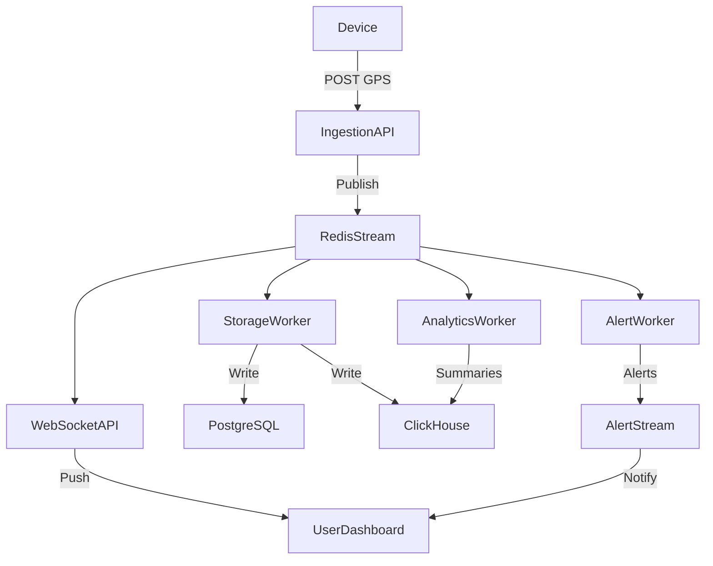

# SWM-FLEET: Fleet Master & Device Registry Platform: Knowledge Transfer (KT)


## Services (13 total)
# Infrastructure
- redis - In-memory cache & pub/sub, port 6379
- postgres - Relational DB (PostGIS), port 55432
- clickhouse - Analytics DB, port 8123 (HTTP) / 9000 (native)
- prometheus - Metrics store, port 9090
- grafana - Dashboards, port 3000
- nginx - Reverse proxy, port 80

# Applications (APIs)
- ingestion-api - GPS webhook handler, port 8001
- websocket-api - Live updates broadcaster, port 8002
- admin-api - REST API for data/status, port 8003
Workers
- realtime-worker - Live cache updater (Redis)
- storage-worker - Persists telemetry to Postgres/ClickHouse
- analytics-worker - Derives analytics from telemetry
- alert-worker - Generates alerts from events

# Workers
realtime-worker - Live cache updater (Redis)
storage-worker - Persists telemetry to Postgres/ClickHouse
analytics-worker - Derives analytics from telemetry
alert-worker - Generates alerts from events

## 1. What Does the Platform Do?

- Collects GPS data from hundreds of fleet devices in real time.
- Processes, stores, analyzes, and alerts on this data.
- APIs and workers handle ingestion, real-time updates, analytics, and alerts.
- Uses Redis, PostgreSQL, ClickHouse, Prometheus, Grafana for data, analytics, and monitoring.

---

## 2. High-Level Data Flow

1. **Devices send GPS data** to the platform (to the `ingestion-api`).
2. **Ingestion API** validates and normalizes the data, then publishes it to a Redis stream.
3. **WebSocket API** and **workers** (background services) subscribe to the Redis stream:
   - **WebSocket API**: Pushes real-time updates to dashboards/users.
   - **Storage Worker**: Saves data to PostgreSQL (for operations) and ClickHouse (for analytics).
   - **Analytics Worker**: Computes summaries, trends, and aggregates.
   - **Alert Worker**: Checks for rule violations (e.g., speeding, geofence breaches) and triggers alerts.
4. **Retry and Dead-Letter Queues**: If something fails, data is retried or sent to a "dead-letter" queue for manual review.
5. **Admins/Users** can access data and analytics via the **Admin API** or real-time via WebSocket.

---

## 3. Directory Structure Explained

### apps/
- **ingestion-api/**: Receives GPS data from devices.
- **websocket-api/**: Sends real-time updates to clients (dashboards, apps).
- **admin-api/**: Admin endpoints for platform status, health, and metrics.

### workers/
- **realtime-worker/**: Handles real-time data processing.
- **storage-worker/**: Persists data to databases.
- **analytics-worker/**: Runs analytics jobs (summaries, trends).
- **alert-worker/**: Monitors for alerts (e.g., geofence, speed).

### libs/
- **common/**: Shared utilities (logging, settings, metrics).
- **schemas/**: Data validation and normalization logic.
- **db/**: Database models and repository logic.
- **redis/**: Redis stream logic, pub/sub, retry, DLQ, etc.
- **auth/**: Authentication and token logic.
- **models/**: Canonical data models (e.g., telemetry).

### infra/
- **docker-compose.yml**: Defines all services for local/dev deployment.
- **nginx/**, **prometheus/**, **grafana/**: Infrastructure for routing, monitoring, and dashboards.

### scripts/
- Utility scripts for checks, migrations, load testing, etc.

### tests/
- Automated tests for all components.

### docs/
- Architecture, deployment, and usage documentation.

---

## 4. Step-by-Step Process Flow

### A. Data Ingestion
- Devices POST GPS data to `ingestion-api`.
- Data is validated and normalized (using `libs/schemas/`).
- Published to Redis stream `gps.telemetry.raw`.

### B. Real-Time Fanout
- `websocket-api` subscribes to Redis and pushes updates to clients.
- `realtime-worker` may also process and forward data.

### C. Storage
- `storage-worker` reads from Redis, writes to PostgreSQL (for operations) and ClickHouse (for analytics).

### D. Analytics
- `analytics-worker` reads from Redis, computes rollups, aggregates, and stores results.

### E. Alerts
- `alert-worker` checks for rule violations (e.g., speeding, geofence).
- Publishes alerts to a dedicated Redis stream.

### F. Retry & Dead-Letter
- If a worker fails to process a message, it’s moved to a retry stream.
- After max retries, it goes to a dead-letter queue for manual review.

---

## 5. How to Independently Check Each Process

- **APIs**: Use tools like `curl` or Postman to hit `/healthz` and `/metrics` endpoints for each API.
- **Workers**: Check logs, metrics, and Redis stream lengths (via `redis-cli` or monitoring dashboards).
- **Data Storage**: Query PostgreSQL and ClickHouse directly to verify data persistence.
- **Analytics**: Check analytics tables in ClickHouse or output from the analytics worker.
- **Alerts**: Review alert streams in Redis or check alert notifications.
- **Retry/DLQ**: Monitor retry and dead-letter streams in Redis for failed messages.
- **Monitoring**: Use Prometheus and Grafana dashboards for system health and metrics.

---

## 6. Example: End-to-End Data Journey

1. **Device** → sends GPS data → **ingestion-api**
2. **ingestion-api** → validates, normalizes → **Redis stream**
3. **websocket-api** & **workers** → consume from Redis
4. **storage-worker** → saves to DBs
5. **analytics-worker** → computes summaries
6. **alert-worker** → triggers alerts if needed
7. **Admin API** or **WebSocket** → exposes data to users

---

## 7. How to Run and Test

- **Start everything**: `make compose-up`
- **Check health**: Visit `/healthz` endpoints or use `docker ps` to see running containers.
- **Run tests**: `make test`
- **Lint/typecheck**: `make lint`, `make typecheck`
- **Monitor**: Access Grafana dashboards (see infra/grafana/).

---

## 8. Visual Process Flow (Layman’s Diagram)



---

## 10. Detailed Data Flow: Tables, Streams, and Data Movement

### 1. Device Data Ingestion

- **Source:** GPS device sends data (IMEI, timestamp, lat/lon, speed, etc.) to the `ingestion-api`.
- **Validation/Normalization:** `ingestion-api` uses schemas from `libs/schemas/` to validate and normalize the payload.
- **Redis Stream:** Data is published to the Redis stream `gps.telemetry.raw` using the `RedisTelemetryProducer` (see `libs/redis/src/swm_redis/streams.py`).
    - **Stream Schema:** Canonical telemetry event (device_id, imei, timestamp, latitude, longitude, speed_kph, heading, accuracy, battery_percent, attributes, trace_id, correlation_id).
- **Consumer Groups:** Multiple consumers (workers, websocket-api) subscribe to this stream.

### 2. Real-Time Fanout

- **WebSocket API:** Subscribes to `gps.telemetry.raw` and pushes real-time updates to dashboards/users.
- **How:** Uses Redis XREADGROUP to pull new messages as they arrive.

### 3. Storage

- **Worker:** `storage-worker` subscribes to `gps.telemetry.raw`.
- **Database Table:** Writes each event to the `device_events` table in PostgreSQL (see `DeviceEventORM` in `libs/db/src/swm_db/models.py`).
    - **Table Columns:** device_id, ts, lat, lon, speed_kph, heading, ignition, attributes, etc.
- **Analytics DB:** Also writes to ClickHouse for historical analytics (table structure similar to PostgreSQL, optimized for fast queries).

### 4. Analytics

- **Worker:** `analytics-worker` subscribes to `gps.telemetry.raw`.
- **PostgreSQL analytics tables:**
    - `analytics_vehicle_state`
    - `analytics_trip_records`
    - `analytics_idle_records`
    - `analytics_overspeed_events`
    - `analytics_geofence_events`
    - `analytics_daily_kpis`
- **Derived outputs:** trip detection, idle segments, overspeed events, geofence entry/exit/dwell, route deviation, and daily KPI rollups.
- **Admin API read layer:**
    - `/analytics/trips`
    - `/analytics/idle-segments`
    - `/analytics/overspeed-events`
    - `/analytics/geofence-events`
    - `/analytics/reports/daily|monthly|quarterly|half-yearly|annual`

### 5. Alerts

- **Worker:** `alert-worker` subscribes to `gps.telemetry.raw`.
- **Logic:** Checks for geofence breaches, speed violations, etc.
- **Alert Stream:** Publishes alert events to `alert.events.stream` in Redis.
- **Database Table:** Alerts may be persisted to a dedicated alerts table (not shown above, but typical in such systems).

### 6. Retry and Dead-Letter Queues

- **Retry Stream:** If a worker fails to process a message, it is pushed to `gps.telemetry.retry`.
    - **Schema:** Original message + retry metadata (retry_count, last_error, backoff_until, etc.).
- **Poison/Dead-Letter Stream:** After max retries, message is pushed to `gps.telemetry.failed` (DLQ).
- **How:** Handled by the stream consumer framework in `libs/redis/src/swm_redis/streams.py`.

### 7. Device/Vehicle/Geofence/Other Tables

- **Device Table:** `devices` (DeviceORM) — stores device metadata (IMEI, vendor, health, etc.).
- **Vehicle Table:** `vehicles` (VehicleORM) — stores vehicle info (number, registration, type, status, etc.).
- **Assignment Table:** `device_vehicle_assignments` — tracks which device is assigned to which vehicle and when.
- **Geofence Table:** `geofences` — stores geofence definitions (type, geometry, etc.).
- **Other Tables:** `vendors`, `contractors`, `wards`, `routes`, etc. for master data.

---

## Example: Data Journey for a Single GPS Event

1. **Device** sends GPS data → **ingestion-api**.
2. **ingestion-api** validates, normalizes, and publishes to **Redis stream** `gps.telemetry.raw`.
3. **storage-worker** pulls from `gps.telemetry.raw` and writes to **device_events** table (PostgreSQL) and ClickHouse.
4. **analytics-worker** pulls from `gps.telemetry.raw` and writes aggregates to ClickHouse.

---

## 11. Full Technical Architecture Review

### Platform Purpose

A real-time fleet master data and GPS telemetry platform that:
- Ingests GPS data from **N vendors** (via webhook)
- Fans out events to **4 parallel worker pipelines** via Redis Streams
- Provides real-time location to dashboards via WebSocket
- Persists to **PostgreSQL** (operational) + **ClickHouse** (analytical)
- Alerts on threshold violations (overspeed, stale GPS)
- Exposes admin CRUD for the master data model
- Targets: **600+ devices, 600+ events/sec**

---

### Full Data Flow — End to End

```
Vendor Device
    │
    │  POST /webhook/gps
    │  Headers: X-Vendor-Id, X-Request-Id
    │  Body: JSON array of GPS fixes
    ▼
┌─────────────────────────────────────────────────────┐
│           ingestion-api  (port 8001 via nginx)       │
│                                                      │
│  1. Parse JSON body (orjson)                        │
│  2. Alias-normalize field names (lat/latitude etc.) │
│  3. Pydantic v2 batch validate → GpsFix[]           │
│  4. Per-fix: build CanonicalTelemetryEvent           │
│  5. Redis realtime cache lookup: IMEI → device_id   │
│     (truck:last:<imei>  — cache miss tolerated)     │
│  6. asyncio.gather: bulk XADD to stream             │
│     → gps.telemetry.raw  (MAXLEN ~ 100,000)         │
│  7. Return 202 + {accepted, published, rejected,    │
│     latency_ms, error_summary}                      │
└──────────────────────┬──────────────────────────────┘
                       │ Redis Stream: gps.telemetry.raw
          ─────────────┴──────────────────────
         │             │             │         │
         ▼             ▼             ▼         ▼
  [group:realtime] [group:storage] [group:analytics] [group:alert]
         │             │             │         │
         ▼             ▼             ▼         ▼
  realtime-worker storage-worker analytics  alert-worker
```

---

### Redis Stream Topology

#### Primary stream: `gps.telemetry.raw`

| Property | Value |
|---|---|
| MAXLEN | ~100,000 (approximate trim) |
| Retention | ~1 hour implicit via lag |
| Message format | Flat string dict (all values strings) |

**Consumer Groups on this stream:**

| Group Name | Worker | Batch Size | Retry Stream | Poison (DLQ) |
|---|---|---|---|---|
| `realtime` | realtime-worker | 1,000 | `gps.telemetry.raw.realtime.retry` | `gps.telemetry.raw.realtime.poison` |
| `storage` | storage-worker | 2,000 | `gps.telemetry.raw.storage.retry` | `gps.telemetry.raw.storage.poison` |
| `analytics` | analytics-worker | 1,000 | `gps.telemetry.raw.analytics.retry` | `gps.telemetry.raw.analytics.poison` |
| `alert` | alert-worker | 1,000 | `gps.telemetry.raw.alert.retry` | `gps.telemetry.raw.alert.poison` |

> Each worker has its own independent retry + poison/DLQ pair, so one failing group never blocks others.

#### Admin-visible failure streams
- `gps.telemetry.retry` — ingestion-level quarantine (validation failures, publish errors)
- `gps.telemetry.failed` — ingestion-level dead-letter queue

#### Pub/Sub channels (real-time push, not durable)

| Channel | Published by | Consumed by |
|---|---|---|
| `live_updates` | realtime-worker | websocket-api |
| `alert_events` | alert-worker | websocket-api / notification service |
| `fleet_events` | (future) | dashboards |
| `dashboard_updates` | (future) | dashboards |
| `telemetry.events` | ingestion-api (legacy `/v1/events`) | websocket-api |

---

### Component Deep-Dive

#### `ingestion-api` (FastAPI, port 8001)

**Entry point:** `POST /webhook/gps`

Processing pipeline per request:
1. **Raw body parsed** with `orjson` (fast JSON)
2. **Alias resolution** — maps `latitude→lat`, `longitude→lng`, `ignition→acc_status`, `timestamp→ts`, etc.
3. **Pydantic v2 batch validation** via `TypeAdapter[list[GpsFix]]` — entire array in one pass; invalid indices collected
4. **Parallel device-context enrichment** — `asyncio.gather` fires IMEI lookups against `truck:last:<imei>` Redis hash; cache miss tolerated (device_id left empty, downstream late-binds)
5. **Canonical event construction** — `CanonicalTelemetryEvent` with vendor_id, request_id, trace_id, received_at
6. **Batch XADD** in chunks of 100, up to 8 parallel batches via `asyncio.gather`
7. Returns structured `GpsWebhookResponse` with per-field error breakdown

**Also exposes:** `GET /healthz`, `GET /metrics` (Prometheus), `POST /v1/events` (legacy pub/sub path)

**Prometheus metrics emitted:**
- `swm_webhook_gps_events_total` — by vendor + outcome
- `swm_webhook_gps_processing_seconds` — histogram with SLO buckets up to 500ms
- `swm_webhook_gps_slo_violations_total` — requests exceeding 50ms
- `swm_webhook_gps_payload_records_total` — by stage (received / validated / published)
- `swm_webhook_gps_validation_failures_total`
- `swm_webhook_gps_publish_failures_total`

---

#### `realtime-worker`

**Group:** `realtime` on `gps.telemetry.raw`

Per batch:
1. Deserializes `CanonicalTelemetry.from_stream_data()`
2. **Writes to realtime cache** (Redis Hash TTL 2h):
   - `truck:last:<imei>` — lat, lon, speed, heading, ignition, device_id
   - `truck:state:<imei>` — computed fleet bucket
   - `truck:last_seen:<imei>` — timestamp (TTL 24h)
3. **Computes fleet bucket** (state machine):
   - `MOVING` — speed ≥ 5 km/h
   - `IDLE` — acc_status=1, speed < 5
   - `PARKED` — acc_status=0, speed < 5
   - `OFFLINE` — event_ts > 5 minutes ago
4. **Publishes to `live_updates` pub/sub channel** — minimal payload `{imei, vehicle_id, lat, lng, speed, status, event_ts}`

This is the hot path for live dashboard updates. **No DB writes.**

---

#### `storage-worker`

**Group:** `storage` on `gps.telemetry.raw`, batch size 2,000

Per batch, fires both writes in parallel:
1. **PostgreSQL** → `device_events` table via SQLAlchemy async bulk insert
   - Columns: device_id, ts, lat, lon, speed_kph, heading, ignition, attributes (JSONB — holds imei, vendor_id, vehicle_id, odometer, fuel_level, raw_payload)
2. **ClickHouse** → `raw_telemetry` table via `ClickHouseRawTelemetryClient`
   - Ensures table exists on startup; bulk inserts `CanonicalTelemetry` objects

**Fallback:** if device_id or vehicle_id missing, uses IMEI as device_id and `"unknown"` as vehicle_id, logs a warning.

---

#### `analytics-worker`

**Group:** `analytics` on `gps.telemetry.raw`, batch size 1,000

**Current state: skeleton/stub** — counts moving vs. overspeed events per batch and logs metrics.

**TODO:** persist trip start/end, overspeed events, geofence enter/exit to PostgreSQL via `swm_db` repositories.

---

#### `alert-worker`

**Group:** `alert` on `gps.telemetry.raw`, batch size 1,000

Current checks (skeleton):
- **Overspeed** — speed ≥ 90 km/h → severity `high`
- **Stale GPS** — event_ts > 5 min old → severity `medium`

Publishes alert payload to `alert_events` pub/sub channel.

---

#### `websocket-api` (FastAPI, port 8002)

**Entry point:** `WS /ws/realtime`

- Subscribes to Redis pub/sub channel `telemetry.events`
- Streams every message to the connected WebSocket client
- Tracks active connection count via `WEBSOCKET_CONNECTIONS` Prometheus gauge
- **Note:** Currently subscribed to legacy `telemetry.events` channel, not yet wired to `live_updates` from realtime-worker

---

#### `admin-api` (FastAPI, port 8003)

Full CRUD + list + CSV bulk-import for master data:

| Entity | Table | Endpoints |
|---|---|---|
| Vendors | `vendors` | CRUD + list + search + sort |
| Devices | `devices` | CRUD + list + search + bulk CSV import |
| Vehicles | `vehicles` | CRUD + list + search + bulk CSV import |
| Contractors | `contractors` | CRUD + list |
| Wards | `wards` | CRUD + list |
| Routes | `routes` | CRUD + list |
| Geofences | `geofences` | CRUD + list |
| Device-Vehicle Assignments | `device_vehicle_assignments` | Create + list + deactivate |

**Ingestion failure inspection:**
- `GET /v1/ingestion/failures` — reads from `gps.telemetry.retry` (quarantine) and `gps.telemetry.failed` (DLQ)
- Returns structured `IngestionFailureRecord` with vendor_id, stage, reason, retryable flag, raw payload

**RBAC:** Hook present (`x-role` header → `RoleContext`) — currently open, marked for JWT/OPA integration.

---

### PostgreSQL Schema (Operational)

| Table | Purpose |
|---|---|
| `device_events` | Time-series GPS events (int PK, JSONB attributes) |
| `vendors` | GPS device vendors (UUID PK, auth_type, allowed_ips, webhook_secret) |
| `devices` | Physical GPS devices (IMEI, health_status, firmware_version) |
| `vehicles` | Fleet vehicles (registration_no, fuel_type, contractor_id) |
| `device_vehicle_assignments` | IMEI↔vehicle time-bound assignments |
| `contractors` | Waste collection contractors |
| `wards` | Municipal ward / zone master |
| `routes` | Route master (start/end, expected distance/duration) |
| `geofences` | Polygon/circle geofence definitions |

All master tables use **UUID PKs**, have `created_at`/`updated_at`, soft-delete `deleted_at`, and audit `created_by`/`updated_by`.

---

### Redis Key Topology

| Key Pattern | Type | TTL | Purpose |
|---|---|---|---|
| `truck:last:<imei>` | Hash | 2h | Latest GPS fix (used by ingestion for device lookup) |
| `truck:state:<imei>` | Hash | 2h | Fleet bucket (MOVING/IDLE/PARKED/OFFLINE) |
| `truck:last_seen:<imei>` | String | 24h | Last event timestamp |
| `truck:trip:<imei>` | Hash | 6h | Active trip context |
| `truck:geofence:<imei>` | Hash | 6h | Current geofence membership |
| `fleet:moving` / `fleet:idle` / `fleet:parked` / `fleet:offline` | Set | — | Fleet bucketing for dashboard aggregates |
| `geo:vehicles` / `geo:depots` / `geo:zones` | Geo | — | Redis GEO sorted sets for proximity queries |
| `ws:connections` | Set | — | Active WebSocket session IDs |
| `user:sessions:<user_id>` | Set | 5m | Per-user WebSocket session IDs |
| `ws:user:<session_id>` | Hash | 5m | WebSocket session payload |
| `rl:<scope>:<key>` | Sorted Set | sliding window | Rate limiter buckets |
| `swm:stream:checkpoint:<group>` | String | 7d | Consumer group stream checkpoint |

---

### Stream Consumer Framework (libs/redis)

`RedisStreamBatchConsumer` base class provides:
- **XREADGROUP** — at-least-once delivery, block 1s
- **XACK** — per-message after successful batch
- **Pending re-claim** — `XCLAIM` messages idle > 2 min, moves to retry stream
- **Checkpoint** — stores last processed ID in Redis key (TTL 7 days)
- **Graceful shutdown** — `SIGINT`/`SIGTERM` sets stop event
- **Prometheus metrics** — batch total, message total, batch duration histogram, pending gauge
- **Exponential backoff** on Redis errors (up to 5s max)

---

### Infra Stack (docker-compose)

| Service | Image | Port | Resources |
|---|---|---|---|
| nginx | custom | 80→8080 | 256MB, 0.5 CPU |
| redis | redis:7.2-alpine | 6379 | 2GB, 1.5 CPU, AOF+RDB |
| postgres | postgis/postgis:16-3.4 | 55432 | 1GB, 1 CPU |
| clickhouse | clickhouse:24.8 | 8123/9000 | 2GB, 2 CPU |
| prometheus | prom:v2.54.1 | 9090 | 768MB, 1 CPU, 30d retention |
| grafana | grafana:11.2.0 | 3000 | 512MB, 0.75 CPU |
| ingestion-api | custom | 8001 | — |
| websocket-api | custom | 8002 | — |
| admin-api | custom | 8003 | — |
| realtime-worker | custom | — | — |
| storage-worker | custom | — | — |
| analytics-worker | custom | — | — |
| alert-worker | custom | — | — |

Redis is configured with: `appendonly yes`, `appendfsync everysec`, `maxmemory 1536MB`, `maxmemory-policy allkeys-lru`.

---

### Advanced Redis Features Built (libs/redis)

| Feature | Class | Description |
|---|---|---|
| Rate Limiter | `SlidingWindowRedisRateLimiter` | Lua-based atomic sliding window, 4 scopes: global/vendor/ip/imei |
| Distributed Lock | `RedisDistributedLock` | SET NX EX + auto-renew heartbeat + Lua release/renew, deadlock prevention |
| GEO Service | `RedisGeoService` | GEOADD/GEOSEARCH for vehicle proximity, depot/zone lookup |
| WebSocket Sessions | `WebSocketSessionService` | Connect/disconnect/heartbeat/cleanup with Redis Set + Hash |
| Pub/Sub | `RedisPubSubPublisher` | Typed channels enum, backpressure policies (BLOCK/DROP_NEW/DROP_OLDEST), queue depth metrics |
| List Queue | `list_queue.py` | Redis LIST-based job queue |
| Streams Producer | `TelemetryStreamProducer` | Typed XADD wrapper for `CanonicalTelemetry` |

---

### What Is Skeletal / Not Yet Built

| Area | Status | What's Missing |
|---|---|---|
| `analytics-worker` | Skeleton | Trip detection, overspeed persistence, geofence enter/exit, ClickHouse rollup writes |
| `alert-worker` | Skeleton | Only 2 hardcoded rules; no DB-driven rules, no geofence breach check |
| WebSocket auth | Open | No JWT/token validation on `/ws/realtime` |
| Admin API RBAC | Stub | `x-role` header only; no JWT/OPA integration |
| WebSocket channel mismatch | Bug | `websocket-api` subscribes to `telemetry.events` (legacy), not `live_updates` (realtime-worker path) |
| Geofence breach detection | Not implemented | `TruckGeofence` Redis state and `GeofenceRepository` exist but no worker computes intersections |
| Report generation | Documented only | `report.jobs` stream defined in docs; no `report-worker` process exists |
| Replay worker | Documented only | `replay.jobs` stream defined; no `replay-worker` process |
| Retry/DLQ workers | Not implemented | Per-worker retry streams exist but no separate retry-processor process |
| Notification service | Not implemented | `alert_events` published but no email/SMS/push dispatcher |
| Vendor auth in hot path | Not wired | `libs/auth` exists but not called in ingestion-api webhook |
| ClickHouse migrations | Manual | `migrate_clickhouse_raw_telemetry.py` exists; not automated in CI |
| Multi-instance consumers | Single instance | `consumer_name` hardcoded as `<service>-1`; no horizontal scaling config |

---

### Next Development Priorities

| Priority | Work Item |
|---|---|
| 1 | **Fix WebSocket channel** — wire `websocket-api` to `live_updates` pub/sub channel instead of `telemetry.events` |
| 2 | **Vendor auth in hot path** — use `libs/auth` to validate `X-Vendor-Id` + HMAC/IP against `vendors` table via Redis-cached vendor config |
| 3 | **Analytics worker** — implement trip start/end detection, persist aggregates to ClickHouse rollup tables |
| 4 | **Alert rules engine** — load rules from PostgreSQL at startup (geofence polygons, speed thresholds per vehicle), evaluate per event, persist alerts to an `alerts` table |
| 5 | **Geofence breach detection** — use `RedisGeoService` + `truck:geofence:<imei>` state to detect enter/exit events |
| 6 | **RBAC / JWT** — wire `libs/auth` into admin-api; protect `/ws/realtime` with token-based auth |
| 7 | **Horizontal scaling** — replace hardcoded `consumer_name="<svc>-1"` with `hostname + PID`; test competing consumer behavior |
| 8 | **Report worker** — implement `report-worker` consuming `report.jobs` stream, generating CSV/PDF exports |
| 9 | **Retry processors** — add retry-worker processes that reclaim from `*.retry` streams with exponential backoff |
| 10 | **Notification service** — consume `alert_events` pub/sub and dispatch email/SMS/push |
5. **alert-worker** pulls from `gps.telemetry.raw`, checks for violations, and publishes to `alert.events.stream` if needed.
6. **websocket-api** pulls from `gps.telemetry.raw` and pushes to dashboards.
7. If any worker fails, the message is retried via `gps.telemetry.retry` and, after max retries, sent to `gps.telemetry.failed` (DLQ).

---

## Redis Streams and Consumer Groups

- **gps.telemetry.raw**: Main telemetry stream (all device events).
    - **Consumer Groups:** ingestion-api:telemetry-processor, analytics-worker:telemetry-consumer, websocket-api, storage-worker, alert-worker.
- **gps.telemetry.retry**: For failed messages awaiting retry.
    - **Consumer Group:** retry-worker:telemetry-retry-processor.
- **gps.telemetry.failed**: Dead-letter queue for permanently failed messages.
    - **Consumer Group:** dlq-monitor:telemetry-failure-handler.
- **analytics.jobs**: For analytics job requests.
- **alert.events.stream**: For alert events.

---

## How Data is Pushed and Pulled

- **Pushed:** Data is pushed to Redis streams using XADD (by APIs and workers).
- **Pulled:** Data is pulled from Redis streams using XREADGROUP (by workers and websocket-api).
- **Database Writes:** Workers write to tables using SQLAlchemy ORM models (see `models.py`).
- **Retry/DLQ:** Handled automatically by the stream consumer framework.

---

## 11. Stream Naming and Storage Update (May 2026)

- Legacy stream name `telemetry.gps` has been fully replaced with `gps.telemetry.raw` across APIs, workers, shared Redis helpers, test suites, Docker compose env values, and runbook/load-test docs.
- Worker-specific retry and poison streams now consistently use the `gps.telemetry.raw.*` prefix.
- `storage-worker` now performs dual writes per consumed batch:
    - PostgreSQL table `device_events` (operational/raw event history)
    - ClickHouse table `raw_telemetry` (analytics-optimized raw telemetry)
- Batch processing remains at-least-once. If a partial sink failure occurs after one sink succeeds, retries can create duplicates unless idempotency controls are added.

---

## 9. Where to Find What

- **API code**: `apps/`
- **Worker code**: `workers/`
- **Shared logic**: `libs/`
- **Infra setup**: `infra/`
- **Docs**: `docs/`
- **Tests**: `tests/`
- **Scripts**: `scripts/`
