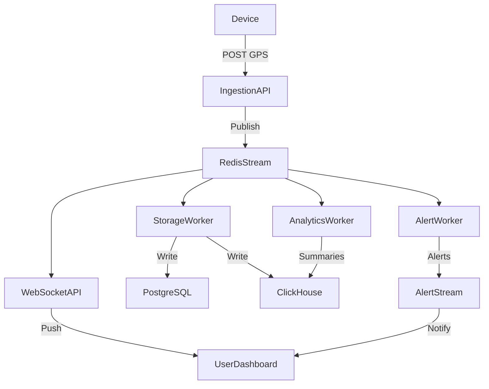

# SWM Fleet GPS Telemetry Platform: Knowledge Transfer (KT)

## 1. What Does the Platform Do?

- Collects GPS data from hundreds of fleet devices in real time.
- Processes, stores, analyzes, and alerts on this data.
- APIs and workers handle ingestion, real-time updates, analytics, and alerts.
- Uses Redis, PostgreSQL, ClickHouse, Prometheus, Grafana for data, analytics, and monitoring.

---

## 2. High-Level Data Flow

1. **Devices send GPS data** to the platform (to the `ingestion-api`).
2. **Ingestion API** validates and normalizes the data, then publishes it to a Redis stream.
3. **WebSocket API** and **workers** (background services) subscribe to the Redis stream:
   - **WebSocket API**: Pushes real-time updates to dashboards/users.
   - **Storage Worker**: Saves data to PostgreSQL (for operations) and ClickHouse (for analytics).
   - **Analytics Worker**: Computes summaries, trends, and aggregates.
   - **Alert Worker**: Checks for rule violations (e.g., speeding, geofence breaches) and triggers alerts.
4. **Retry and Dead-Letter Queues**: If something fails, data is retried or sent to a "dead-letter" queue for manual review.
5. **Admins/Users** can access data and analytics via the **Admin API** or real-time via WebSocket.

---

## 3. Directory Structure Explained

### apps/
- **ingestion-api/**: Receives GPS data from devices.
- **websocket-api/**: Sends real-time updates to clients (dashboards, apps).
- **admin-api/**: Admin endpoints for platform status, health, and metrics.

### workers/
- **realtime-worker/**: Handles real-time data processing.
- **storage-worker/**: Persists data to databases.
- **analytics-worker/**: Runs analytics jobs (summaries, trends).
- **alert-worker/**: Monitors for alerts (e.g., geofence, speed).

### libs/
- **common/**: Shared utilities (logging, settings, metrics).
- **schemas/**: Data validation and normalization logic.
- **db/**: Database models and repository logic.
- **redis/**: Redis stream logic, pub/sub, retry, DLQ, etc.
- **auth/**: Authentication and token logic.
- **models/**: Canonical data models (e.g., telemetry).

### infra/
- **docker-compose.yml**: Defines all services for local/dev deployment.
- **nginx/**, **prometheus/**, **grafana/**: Infrastructure for routing, monitoring, and dashboards.

### scripts/
- Utility scripts for checks, migrations, load testing, etc.

### tests/
- Automated tests for all components.

### docs/
- Architecture, deployment, and usage documentation.

---

## 4. Step-by-Step Process Flow

### A. Data Ingestion
- Devices POST GPS data to `ingestion-api`.
- Data is validated and normalized (using `libs/schemas/`).
- Published to Redis stream `gps.telemetry.raw`.

### B. Real-Time Fanout
- `websocket-api` subscribes to Redis and pushes updates to clients.
- `realtime-worker` may also process and forward data.

### C. Storage
- `storage-worker` reads from Redis, writes to PostgreSQL (for operations) and ClickHouse (for analytics).

### D. Analytics
- `analytics-worker` reads from Redis, computes rollups, aggregates, and stores results.

### E. Alerts
- `alert-worker` checks for rule violations (e.g., speeding, geofence).
- Publishes alerts to a dedicated Redis stream.

### F. Retry & Dead-Letter
- If a worker fails to process a message, it’s moved to a retry stream.
- After max retries, it goes to a dead-letter queue for manual review.

---

## 5. How to Independently Check Each Process

- **APIs**: Use tools like `curl` or Postman to hit `/healthz` and `/metrics` endpoints for each API.
- **Workers**: Check logs, metrics, and Redis stream lengths (via `redis-cli` or monitoring dashboards).
- **Data Storage**: Query PostgreSQL and ClickHouse directly to verify data persistence.
- **Analytics**: Check analytics tables in ClickHouse or output from the analytics worker.
- **Alerts**: Review alert streams in Redis or check alert notifications.
- **Retry/DLQ**: Monitor retry and dead-letter streams in Redis for failed messages.
- **Monitoring**: Use Prometheus and Grafana dashboards for system health and metrics.

---

## 6. Example: End-to-End Data Journey

1. **Device** → sends GPS data → **ingestion-api**
2. **ingestion-api** → validates, normalizes → **Redis stream**
3. **websocket-api** & **workers** → consume from Redis
4. **storage-worker** → saves to DBs
5. **analytics-worker** → computes summaries
6. **alert-worker** → triggers alerts if needed
7. **Admin API** or **WebSocket** → exposes data to users

---

## 7. How to Run and Test

- **Start everything**: `make compose-up`
- **Check health**: Visit `/healthz` endpoints or use `docker ps` to see running containers.
- **Run tests**: `make test`
- **Lint/typecheck**: `make lint`, `make typecheck`
- **Monitor**: Access Grafana dashboards (see infra/grafana/).

---

## 8. Visual Process Flow (Layman’s Diagram)

---

## 10. Detailed Data Flow: Tables, Streams, and Data Movement

### 1. Device Data Ingestion

- **Source:** GPS device sends data (IMEI, timestamp, lat/lon, speed, etc.) to the `ingestion-api`.
- **Validation/Normalization:** `ingestion-api` uses schemas from `libs/schemas/` to validate and normalize the payload.
- **Redis Stream:** Data is published to the Redis stream `gps.telemetry.raw` using the `RedisTelemetryProducer` (see `libs/redis/src/swm_redis/streams.py`).
    - **Stream Schema:** Canonical telemetry event (device_id, imei, timestamp, latitude, longitude, speed_kph, heading, accuracy, battery_percent, attributes, trace_id, correlation_id).
- **Consumer Groups:** Multiple consumers (workers, websocket-api) subscribe to this stream.

### 2. Real-Time Fanout

- **WebSocket API:** Subscribes to `gps.telemetry.raw` and pushes real-time updates to dashboards/users.
- **How:** Uses Redis XREADGROUP to pull new messages as they arrive.

### 3. Storage

- **Worker:** `storage-worker` subscribes to `gps.telemetry.raw`.
- **Database Table:** Writes each event to the `device_events` table in PostgreSQL (see `DeviceEventORM` in `libs/db/src/swm_db/models.py`).
    - **Table Columns:** device_id, ts, lat, lon, speed_kph, heading, ignition, attributes, etc.
- **Analytics DB:** Also writes to ClickHouse for historical analytics (table structure similar to PostgreSQL, optimized for fast queries).

### 4. Analytics

- **Worker:** `analytics-worker` subscribes to `gps.telemetry.raw`.
- **Job Streams:** May also use streams like `analytics.jobs` for batch analytics tasks.
- **Database Table:** Writes rollups/aggregates to analytics tables in ClickHouse.

### 5. Alerts

- **Worker:** `alert-worker` subscribes to `gps.telemetry.raw`.
- **Logic:** Checks for geofence breaches, speed violations, etc.
- **Alert Stream:** Publishes alert events to `alert.events.stream` in Redis.
- **Database Table:** Alerts may be persisted to a dedicated alerts table (not shown above, but typical in such systems).

### 6. Retry and Dead-Letter Queues

- **Retry Stream:** If a worker fails to process a message, it is pushed to `gps.telemetry.retry`.
    - **Schema:** Original message + retry metadata (retry_count, last_error, backoff_until, etc.).
- **Poison/Dead-Letter Stream:** After max retries, message is pushed to `gps.telemetry.failed` (DLQ).
- **How:** Handled by the stream consumer framework in `libs/redis/src/swm_redis/streams.py`.

### 7. Device/Vehicle/Geofence/Other Tables

- **Device Table:** `devices` (DeviceORM) — stores device metadata (IMEI, vendor, health, etc.).
- **Vehicle Table:** `vehicles` (VehicleORM) — stores vehicle info (number, registration, type, status, etc.).
- **Assignment Table:** `device_vehicle_assignments` — tracks which device is assigned to which vehicle and when.
- **Geofence Table:** `geofences` — stores geofence definitions (type, geometry, etc.).
- **Other Tables:** `vendors`, `contractors`, `wards`, `routes`, etc. for master data.

---

## Example: Data Journey for a Single GPS Event

1. **Device** sends GPS data → **ingestion-api**.
2. **ingestion-api** validates, normalizes, and publishes to **Redis stream** `gps.telemetry.raw`.
3. **storage-worker** pulls from `gps.telemetry.raw` and writes to **device_events** table (PostgreSQL) and ClickHouse.
4. **analytics-worker** pulls from `gps.telemetry.raw` and writes aggregates to ClickHouse.
5. **alert-worker** pulls from `gps.telemetry.raw`, checks for violations, and publishes to `alert.events.stream` if needed.
6. **websocket-api** pulls from `gps.telemetry.raw` and pushes to dashboards.
7. If any worker fails, the message is retried via `gps.telemetry.retry` and, after max retries, sent to `gps.telemetry.failed` (DLQ).

---

## Redis Streams and Consumer Groups

- **gps.telemetry.raw**: Main telemetry stream (all device events).
    - **Consumer Groups:** ingestion-api:telemetry-processor, analytics-worker:telemetry-consumer, websocket-api, storage-worker, alert-worker.
- **gps.telemetry.retry**: For failed messages awaiting retry.
    - **Consumer Group:** retry-worker:telemetry-retry-processor.
- **gps.telemetry.failed**: Dead-letter queue for permanently failed messages.
    - **Consumer Group:** dlq-monitor:telemetry-failure-handler.
- **analytics.jobs**: For analytics job requests.
- **alert.events.stream**: For alert events.

---

## How Data is Pushed and Pulled

- **Pushed:** Data is pushed to Redis streams using XADD (by APIs and workers).
- **Pulled:** Data is pulled from Redis streams using XREADGROUP (by workers and websocket-api).
- **Database Writes:** Workers write to tables using SQLAlchemy ORM models (see `models.py`).
- **Retry/DLQ:** Handled automatically by the stream consumer framework.

---

## 11. Stream Naming and Storage Update (May 2026)

- Legacy stream name `telemetry.gps` has been fully replaced with `gps.telemetry.raw` across APIs, workers, shared Redis helpers, test suites, Docker compose env values, and runbook/load-test docs.
- Worker-specific retry and poison streams now consistently use the `gps.telemetry.raw.*` prefix.
- `storage-worker` now performs dual writes per consumed batch:
    - PostgreSQL table `device_events` (operational/raw event history)
    - ClickHouse table `raw_telemetry` (analytics-optimized raw telemetry)
- Batch processing remains at-least-once. If a partial sink failure occurs after one sink succeeds, retries can create duplicates unless idempotency controls are added.

---

## 9. Where to Find What

- **API code**: `apps/`
- **Worker code**: `workers/`
- **Shared logic**: `libs/`
- **Infra setup**: `infra/`
- **Docs**: `docs/`
- **Tests**: `tests/`
- **Scripts**: `scripts/`
